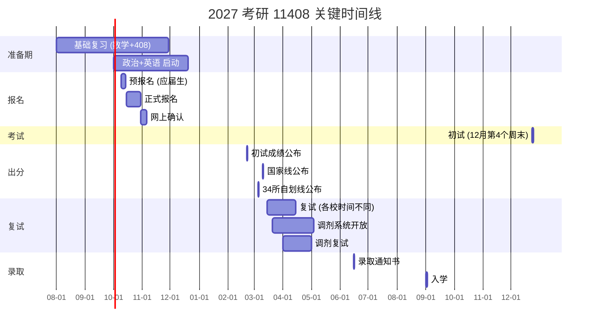

---
tags:
  - type/permanent
  - topic/cs
  - topic/kaoyan
  - topic/graduate-admissions
created: 2026-09-03
source:
  - "https://yz.chsi.com.cn/"
  - "https://yz.chsi.com.cn/kyzx/zt/lnfsx2026.shtml"
data-date: 2026-09-03
---

# 考研 11408 制度知识

> 本文档记录 11408 统考全流程的制度性知识，区分**事实数据**（来自官方渠道）与**判断建议**（标注为「建议」或 judgment）。所有时间节点以 2027 考季（2026‑2027 年度）为实例，但框架适用于任何考季。

---

## 1. 时间线（2027 考季实例）



### 各阶段详细说明

| 阶段 | 预计时间 | 说明 |
|------|----------|------|
| 预报名 | 2026年10月9日-13日（研招网）| 仅应届生可参加；与正式报名同等有效；**建议必填**——可提前熟悉系统、抢考点 |
| 正式报名 | 2026年10月15日-28日（研招网）| 所有考生；可修改预报名信息；逾期不可补报 |
| 网上确认 | 2026年10月30日-11月4日 | 上传照片+学历验证；逾期视为放弃 |
| 准考证打印 | 考前10天 | 研招网下载PDF |
| 初试 | 2027年12月23日-24日（倒数第2个周末）| 23日上午政治/下午英语；24日上午数学/下午408 |
| 成绩公布 | 2027年2月21日前后 | 各省/校不同，可差1-2天 |
| 34所自划线公布 | 2027年3月初 | 早于国家线 |
| 国家线公布 | 2027年3月10日前后 | 含工学A/B类 |
| 复试/调剂 | 2027年3月中旬-4月底 | 各校时间差大 |
| 录取通知书 | 2027年6月中旬 | 平信/EMS |
| 入学 | 2027年9月 | |

> **事实来源**：研招网 yz.chsi.com.cn 历年公告。每年具体日期波动 ±3 天，以当年《全国硕士研究生招生工作管理规定》为准。

---

## 2. 11408 科目结构

### 2.1 科目组成

| 科目 | 代码 | 满分 | 考试时间 | 备注 |
|------|------|------|----------|------|
| 思想政治理论 | 101 | 100 | 12月23日 08:30-11:30 | 全国统一命题 |
| 英语（一） | 201 | 100 | 12月23日 14:00-17:00 | 全国统一命题 |
| 数学（一） | 301 | 150 | 12月24日 08:30-11:30 | 全国统一命题 |
| 计算机学科专业基础 | 408 | 150 | 12月24日 14:00-17:00 | 全国统一命题 |

**总分：500 分。**

### 2.2 数学（一）分值结构

> **来源**：全国硕士研究生招生考试《数学（一）考试大纲》。

| 模块 | 分值 | 占比 | 说明 |
|------|------|------|------|
| 高等数学（含微积分、级数、微分方程） | ~84 | 56% | 含多元函数、曲线曲面积分 |
| 线性代数 | ~33 | 22% | 含矩阵、向量、特征值、二次型 |
| 概率论与数理统计 | ~33 | 22% | 含多维随机变量、参数估计 |

题型分布：单选(10×5=50) + 填空(6×5=30) + 解答(7题共70)。

### 2.3 408 计算机学科专业基础

> **来源**：《计算机学科专业基础综合考试大纲》（全国统考，教育部考试中心）。

| 模块 | 分值 | 题型 | 说明 |
|------|------|------|------|
| 数据结构 | 45 | 选择+综合 | 线性表、树、图、排序、查找 |
| 计算机组成原理 | 45 | 选择+综合 | 数据表示、存储系统、指令系统、CPU、总线、I/O |
| 操作系统 | 35 | 选择+综合 | 进程管理、内存管理、文件管理、I/O |
| 计算机网络 | 25 | 选择+综合 | 五层协议体系、TCP/IP |

题型分布：单选(40×2=80) + 综合(7题共70)。选择题中前 40 题（每题 2 分）覆盖全部四个模块；综合题通常为数据结构 2 题（约 23 分）、组成原理 2 题（约 23 分）、操作系统 1-2 题（约 14 分）、网络 1 题（约 10 分），每年微调。

### 2.4 科目特点与备考判断

**数据（事实）：**
- 408 全国平均分通常 60-75 分（满分 150），区分度大（标准差约 30-40）。
- 数学（一）全国平均分通常 65-80 分（满分 150）。
- 2024 年 11408 考生数学一平均分约 71，408 平均分约 68（据考研机构抽样数据，非官方）。

**建议（judgment）：**
- 408 是 11408 最大辨识度：决定能否进复试的通常是 408 和数学一，而非政治/英语。
- 408 内容广度大但深度比各校自命题浅，适合**跨考生**（只要肯背真题+理解概念可拿 90+），但对名校冲刺（140+档）需要在组成原理和数据结构上投入超过 408 大纲的深度（如 CPU 微架构、多级页表细节）。
- 数学一通常比数二/数三备考周期长 2-3 个月；**确认目标院校考 301（数一）而非自命题后再开始**（部分 985 计算机学硕改考 201+301+408 已成趋势，但也有学校用数二/英二）。

---

## 3. 复试（Re-examination / 复试）

### 3.1 一般形式

复试由招生单位（各院校/研究所）组织，形式包括以下一种或多种组合：

| 环节 | 常见内容 | 权重占比（常见） |
|------|----------|-----------------|
| 专业面试 | 专业基础+研究方向理解+科研经历 | 40%-60% |
| 英语口试 | 自我介绍+问答+文献翻译 | 10%-20% |
| 机试/上机 | 算法编程（C/C++/Python）；LeetCode 中等难度 | 0%-40%（视学校） |
| 专业笔试 | 数据结构+操作系统+组成原理+语言基础 | 0%-30% |

> 各校实际构成差异极大。无统一的 "408 复试" 标准，每个学院有自己的复试方案，通常在复试前 2 周发公告。

### 3.2 常见复试权重比例

**数据来源：** 近年各 985 计算机学院复试方案（以 2024-2025 公布为准，每年可能有微调）。

| 权重模式 | 典型学校（示例） | 实际含义 |
|----------|------------------|----------|
| 5:5 | 清华深研院（部分年份）、浙大计算机（2024） | 初试 50% + 复试 50%；复试 1 分 ≈ 初试 5 分 |
| 6:4 | 中科大计算机（2024）、北航计算机 | 初试 60% + 复试 40%；复试权重较高 |
| 7:3 | 北大信科（2024）、华科计算机（2024） | 初试 70% + 复试 30%；复试权重相对低，但复试不合格仍一票否决 |
| 加权分上限 | 清华（部分年份） | 复试满分 500，初试满分 500，按权重相加 |

**关键判断（judgment）：**
- 复试权重越大，**初试分擦线的逆袭概率越高**，但也意味着**初试高分被刷的概率上升**。选择 5:5 的学校需要更强的面试/机试准备。
- 复试权重低的学校（7:3）：初试分数基本决定录取顺序；对硬实力自信的考生更安全。
- 部分学校设**复试及格线**（如复试总分 60%），不过则一票否决——这点比权重本身更重要：每年都会出现初试 400+ 但复试不及格的案例（多见于清华、上交、浙大的机试）。

---

## 4. 总成绩计算方法

### 4.1 通用公式

常见的两种标准算法：

**加权比例法（最常用）：**
```
总成绩 = (初试总分 ÷ 500) × 初试权重 + (复试总分 ÷ 复试满分) × 复试权重
```
例如 6:4 且复试满分 300 分时：
```
总成绩 = (初试 ÷ 500) × 0.6 + (复试 ÷ 300) × 0.4
```

**分制相加法（部分学校）：**
```
总成绩 = 初试总分 × 权重 + 复试总分 × 权重
```
此时复试满分通常与初试满分相当（如 500 分制）。

### 4.2 实例

| 学校 | 2024 权重 | 复试满分 | 公式 |
|------|-----------|----------|------|
| 中科大计算机 | 6:4 | 100 | 初试÷5×0.6 + 复试×0.4 |
| 北航计算机 | 6:4 | 300 | 初试÷5×0.6 + 复试÷3×0.4 |
| 浙大计算机 | 5:5 | 100 | 初试÷5×0.5 + 复试×0.5 |
| 华科计算机 | 7:3 | 100 | 初试÷5×0.7 + 复试×0.3 |

> **事实来源**：各校研究生招生网当年发布的复试录取工作办法。

### 4.3 关于复试权重的含义

- 当复试权重 ≥ 50% 时（如 5:5），每 1 分复试分的价值等同 1 分初试分，但初试满分为 500、复试满分为 100，相当于**复试 1 分 ≈ 初试 5 分**。复试表现成为决定性因素。
- 建议（judgment）：如果自身表达能力一般 / 机试不熟练 / 英语口语弱，选择 7:3 或 6:4 的学校更安全；如果具备强面试/机试/竞赛经历，5:5 是放大优势的机会。

---

## 5. 选导师策略

> ⚠️ **重要说明**：以下策略基于大量考生经验（收集自牛客、知乎、一亩三分地、小木虫等平台），非教育部官方流程。标注为「建议」的项目尤其需要用户在实际操作中自行核实。

### 5.1 时间点

| 时间 | 动作 | 说明 |
|------|------|------|
| 报名时（10月） | 确定目标校即可，**不需选导师** | 初试报名只填学校+专业，不填导师 |
| 出分后（2月底-3月初） | 开始联系导师 | 确认有希望过复试线后，**邮件联系** |
| 复试前（3月中） | 初步远程沟通/面谈 | 部分导师会在复试前约见（非正式）|
| 复试后/录取后 | 双向选择确认 | 部分学校录取后统一分配 |
| 入学后（9月） | 最终确定 | 部分学校允许入学后轮转再定 |

### 5.2 导师评价信息来源

| 来源 | 信息类型 | 可信度 | AI 可提取 |
|------|----------|--------|-----------|
| CCF 发表记录（dblp/知网）| 研究方向、近3年产出、活跃度 | 高（客观） | ✅ 全部 |
| 国家自然科学基金（NSFC）| 经费状况、项目方向 | 高（客观） | ✅ 全部 |
| Google Scholar / 学校个人主页 | 学生去向、毕业生 | 中高 | ✅ 部分 |
| 小木虫 / 导师评价类网站 | 实验室氛围、工作强度、补助 | 低-中（需交叉验证） | ⚠️ 仅搜索式+摘要 |
| 在校生/毕业生口碑 | 真实体验 | 最高 | ❌ 需用户亲自读 |
| 知乎/牛客/脉脉 搜索 | 长帖评价 | 中（需甄别情绪化） | ⚠️ 部分摘要 |

### 5.3 选导师评估维度（建议/judgment）

> 以下框架来自考生社区长期经验，非任何官方出版物。

1. **研究方向是否新兴且有出口**
   - 看导师近 3 年 CCF A/B 论文关键词变化：停在 5 年前方向不变 → 可能原始创新已枯竭
   - 看毕业生去向：去大厂算法岗 vs. 开发岗 vs. 高校任教 → 反映该方向的产业需求

2. **经费与项目类型**
   - NSFC 面上/重点 > 青年项目 > 企业合作项目 > 纯横向开发
   - 经费充足 ↔ 能养得起学生（津贴+设备+开会）

3. **实验室学生出口周期**
   - 硕士正常毕业 2.5-3 年 vs. 延期 3.5-4 年 → 找往届毕业生问真实毕业时间

4. **导师指导风格**
   - "放养"（每周 1 次组会，自由选题）：适合有自驱力的学生
   - "微管理"（每天打卡，给定子任务）：适合需要强督促的学生
   - "压迫式"（每周 60+ 小时，周末加班）：传说的"压榨"型——小木虫搜索该导师+负面关键词

5. **职称与年龄**
   - 新入职（副教授/无博导资格）→ 冲职称期，push 但学术热情高，接受较多；风险是组不够成熟
   - 中年教授（45-55，有博导资格）→ 稳定期，对硕士自由度较高；需确认是否仅对 PhD 上心
   - 资深教授（55+）→ 可能已无动力写论文，适合就业导向学生；确认是否"导师挂名，博士带"模式

### 5.4 联系导师建议（judgment）

1. **邮件时间**：出分后 48h 内是第一波好时机；最晚不晚于复试前 2 周
2. **邮件内容**：自我介绍 + 初试成绩 + 对方向的真实兴趣（引用导师论文中的具体点） → 切忌群发模板
3. **目标数量**：同一学院内只联系 1-2 位（导师相互交流）；不同学院/学校可以更多
4. **回复判断**：
   - "欢迎报考"/"保持联系" → 未明确承诺；复试无优先
   - "约面谈"/"可以收" → 正面信号
   - 无回复 → 正常；72h 后可简短重发；仍无回复 → 换人
5. **道德约束**：最终同一学校只选择一位导师确认；允许多个学校有 offer 后做选择。

---

## 6. 补充环节

### 6.1 预报名

- 时间：每年 10 月初（2026 年估计 10 月 9 日-13 日）
- 对象：**应届本科毕业生**（往届生直接正式报名）
- 作用：
  - 提前填写报名信息，正式报名时可修改
  - **抢报考点**（热门地区考位有限，晚了可能被分配到偏远考场）
  - 测试系统稳定性
- 建议：必参加。即使目标未定，先填一个作为占位。

### 6.2 备用考点（备用考场）

- 含义：当报考点考位不足时，研招网分配的次选考场（可能跨区甚至跨市）
- 出现情况：热门城市（北京/上海/杭州/南京等）的某些报考点考位 1-2h 内抢完
- 建议：
  - 预报名第一时间缴费锁定考位
  - 如果只能分配到备用考点，提前预订住宿交通
  - 部分城市（如成都、武汉）考位相对宽裕

### 6.3 少数民族骨干计划（少干计划 / 少干）

- **资格**：少数民族考生（部分汉族考生也可在指定贫困县条件下）可申请
- **优势**：单独划线（通常比统招线低 10-30 分）；单独名额（不占统招名额）
- **限制**：毕业后须回**生源地（或指定地区）**工作 5 年；不适用于想留一线就业的考生
- **适用性判断（judgment）**：
  - 适合：确定回西部就业、有民族身份、分数过统招线有困难
  - 不适合：想留北上广深就业、想去大厂

### 6.4 调剂

#### 基本规则

| 条件 | 说明 |
|------|------|
| 总分和单科均过国家线 | A 类考生须过 A 线；B 类可调剂到 B 区院校 |
| 调入专业与第一志愿专业相同或相近 | 原则上在同一学科门类（08 工学） |
| 初试科目与调入专业初试科目相同或相近 | 11408 考生优势：大部分计算机专业接收 408 调剂 |
| 统考科目须同等或更难 | 数一 → 可调剂考数一/数二的学校；英语一同理 |

#### 调剂流程

```
出分 → 过国家线但未进一志愿复试 / 复试被刷
       ↓
   研招网调剂系统（预计 3 月 20 日-4 月底）
       ↓
   填报 3 个平行志愿（每次填报 48h 内不可修改）
       ↓
   学校发送复试通知（考生确认）
       ↓
   参加调剂复试
       ↓
   学校发送待录取通知（考生确认 1 次；确认后不可再改）
```

> **事实来源**：研招网「全国硕士研究生招生网上调剂」历年公告。

#### 关键判断（judgment）

- 三个志愿**平行**但不互相独立：学校可见你的其他志愿，但官方说明「不影响是否发送复试通知」。
- 调剂过程中**电话比系统快**——确定有调剂名额后直接致电研招办表达意愿。
- 11408 在计算机调剂市场是**硬通货**：接受 408 调剂的学校多倍于自主命题学校。2024 年典型的「调剂收割校」包括：杭电、北邮（部分方向）、南航、南京信息工程大学、浙工大等。
- 调剂的 B 区学校（广西大学/云南大学/海南大学/贵州大学/内蒙古大学等）常常比 A 区低 10-20 分，但计算机专业毕业生就业限制显著。
- **调剂是一场信息战**：每年 3 月初（各校公布调剂名额前），牛客/小木虫/各校研究生院官网会有内部名单流出。

### 6.5 夏令营（Summer Camp）与推免

- **推免（推荐免试）**：本科学校推荐 → 目标校接收 → 不需参加统考
- **夏令营**：大三暑假（6月-8月）各校举办的选拔活动；表现优异者获推免预录取资格
- 11408 考生关系：
  - 推免占录取名额的 40%-70%（各校不同，学硕通常推免比例更高）
  - 统考剩余名额 = 总计划 - 推免录取数
  - **部分学校在复试前才公布实际推免录取名单**，统考生需关注名额余量
- 建议（judgment）：非推免资格学生，可关注是否有「优秀营员统考加分政策」（如降分复试线、免复试/免机试）。此项政策各校逐年变动，需直接参看目标校夏令营通知原文。

---

## 7. 国家线历史数据

### 7.1 工学国家线（A/B 类）

> **数据来源**：研招网 yz.chsi.com.cn 「历年考研国家线」专版。工学门类（08 代码）。

| 考季 | A 类总分 | 单科(=100) | 单科(>100) | B 类总分 | 单科(=100) | 单科(>100) |
|------|----------|------------|------------|----------|------------|------------|
| 2021 | 263 | 37 | 56 | 253 | 34 | 51 |
| 2022 | 273 | 38 | 57 | 263 | 35 | 53 |
| 2023 | 273 | 38 | 57 | 263 | 35 | 53 |
| 2024 | 273 | 37 | 56 | 263 | 34 | 51 |
| 2025 | 未公布 (预计 273±5) | — | — | — | — | — |

说明：
- 「单科(=100)」对应政治/英语(一)；「单科(>100)」对应数学(一)/408
- 总分与单科**均须过线**，任一科目不达标则不可参加调剂（部分「破格复试」政策存在但极少）
- A 类：北京/天津/河北/山西/辽宁/吉林/黑龙江/上海/江苏/浙江/安徽/福建/江西/山东/河南/湖北/湖南/广东/重庆/四川/陕西等 21 省（市）
- B 类：内蒙古/广西/海南/贵州/云南/西藏/甘肃/青海/宁夏/新疆等 10 省（区）

### 7.2 34 所自划线

自划线学校不采用国家线（或自划线 ≥ 国家线），且**各学院/专业线可能远高于校线**。

典型 34 所计算机 11408 自划线趋势（数据来源：各校研招网 2024 年公告）：

| 学校 | 2022 计算机学硕线 | 2023 计算机学硕线 | 2024 计算机学硕线 | 趋势 |
|------|-------------------|-------------------|-------------------|------|
| 清华大学 | 365 | 350 | 360 | 稳定 360± |
| 北京大学 | 350 | 355 | 360 | 缓慢上升 |
| 浙江大学 | 345 | 350 | 360 | 上升趋势 |
| 上海交大 | 343 | 355 | 350 | 波动 |
| 中科大 | 340 | 350 | 350 | 稳定 350 |
| 南京大学 | 335 | 340 | 355 | 上涨 |
| 北航 | 340 | 345 | 350 | 上涨 |
| 哈工大 | 330 | 335 | 340 | 缓慢上涨 |

> ⚠️ **注意**：上表为**校线**，**实际录取线**（复试加权后最后一名被录取者的分数）通常比校线高 5-15 分。热门方向（如 AI/ML/DL）实际录取线可能比校线高 20-30 分。

### 7.3 关于国家线趋势的判断（judgment）

- 2022-2024 工学 A 类线稳定在 273（±0），反映国家线在考生基数稳定且扩招有限情况下的内在平衡点。
- 单科线（=100 科目）连续 3 年 37-38，表明政治/英语通过门槛并不高；真正区分考生的环节仍是数一和 408。
- **国家线的实际意义仅为调剂资格线**——目标 985/211 的考生应将关注点放在目标校历年复试线，而非国家线。

---

## 8. 制度层面常见误区

> 基于历年考生反馈整理的常见误解（judgment / anecdotal evidence from forums）。

| 误区 | 事实 |
|------|------|
| "报名时就要确定导师" | 错。初试只填学校和专业；导师在复试录取后双向选择 |
| "调剂 3 个志愿是分先后顺序的" | 错。3 个志愿平行，但学校可见你的其他志愿 |
| "过了校线就能进复试" | 错。校线是全校最低线；学院会再划**专业线**（通常更高） |
| "408 可以临时突击 3 个月" | 误判。408 四门课知识量大，常态备考周期 6-10 个月 |
| "数学一可以用数二的范围来准备" | 危险。数一含概率论+级数+三重积分+曲线曲面积分，数二全无 |
| "国家线过了就有学上" | 错。国家线是调剂资格线；985/211 实际分数线远高于此 |
| "少干计划很划算" | 有条件。少干毕业生 5 年西部服务期是硬性约束，部分学校要求签合同 |

---

## 9. 关键网址索引

| 内容 | 网址 | 备注 |
|------|------|------|
| 研招网（官方主站） | https://yz.chsi.com.cn/ | 报名、成绩、调剂、国家线 |
| 历年分数线专栏 | https://yz.chsi.com.cn/kyzx/zt/lnfsx2026.shtml | 汇总各校复试线 |
| 各校研招网 | 各校网址 | 学院复试方案、导师名单 |
| CCF 推荐目录 | https://www.ccf.org.cn/Academic_Evaluation/ | 论文档次判断标准 |
| NSFC 基金查询 | https://www.nsfc.gov.cn/ | 导师经费状况 |
| dblp 论文检索 | https://dblp.org/ | 公开发表记录（免费） |

---

## 变更记录

| 日期 | 修改者 | 说明 |
|------|--------|------|
| 2026-09-03 | AI (scout) | 初始版本，基于研招网已采集数据+历年公开信息 |